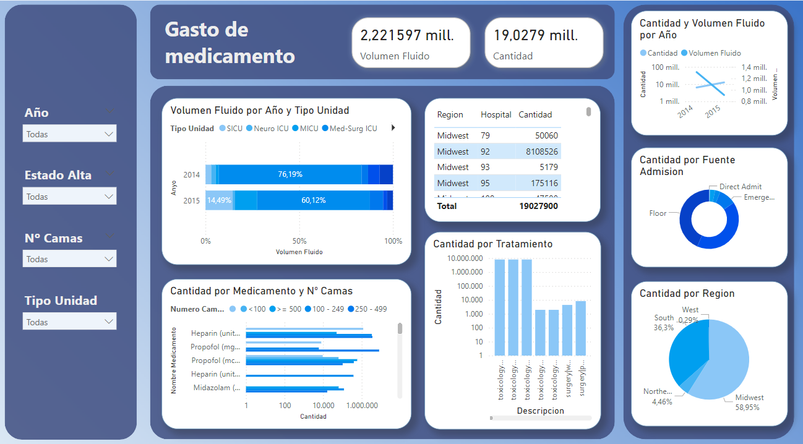

# Data Warehouse for Analyzing Hospital Medication Expenses

## Overview

In modern healthcare, efficient resource management is crucial, particularly in Intensive Care Units (ICUs), where medication costs account for a significant portion of hospital expenses. Despite the availability of large clinical datasets, many hospitals lack specialized analytical tools to track and optimize drug expenditures.

This project addresses this gap by designing a **data warehouse** specifically for analyzing medication costs in ICUs across hospitals in the United States. The project enables identifying spending patterns and optimizing resource allocation.

## Features

- **Data Warehouse Design**: Structured database optimized for querying and analysis.
- **ETL Process**: Extraction, Transformation, and Loading of clinical data.
- **Multidimensional Cube**: Enables advanced analytical queries.
- **Power BI Reports**: Interactive dashboards for visualizing medication expenditures.

## Data Flow

1. **Extract**: Retrieve raw data from clinical databases.
2. **Transform**: Clean and structure the data for analytical processing.
3. **Load**: Store the transformed data into the data warehouse.
4. **Analyze**: Use OLAP cubes and Power BI to generate insights.

## Technologies Used

- **SQL** for data modeling and warehouse design.
- **ETL Tools** for data processing.
- **OLAP Cube** for multidimensional analysis.
- **Power BI** for visualization and reporting.

## Sample Report

## How to Use

1. Clone this repository.
2. Set up the database schema and ETL pipeline.
3. Load the dataset into the data warehouse.
4. Explore the Power BI reports to analyze medication expenses.

## Future Work

- Expanding the dataset to include more hospitals.
- Implementing machine learning models for cost prediction.
- Enhancing real-time data integration.
